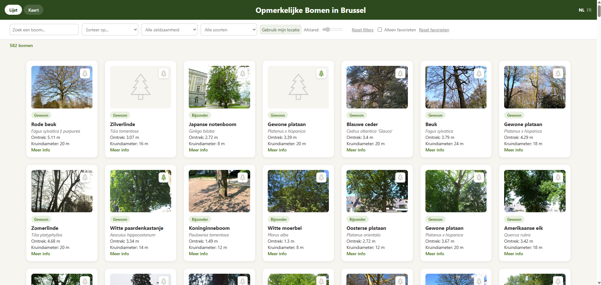

# Remarkable Trees of Brussels

## 1. Projectbeschrijving

**Opmerkelijke Bomen in Brussel** is een interactieve single-page webapplicatie waarmee gebruikers bijzondere bomen in het Brussels Hoofdstedelijk Gewest[^1] kunnen verkennen. De app toont zowel de kenmerken van elke boom (lijstweergave) als de locatie ervan (kaartweergave via Leaflet). Via zoek-, sorteer- en filteropties kunnen gebruikers snel navigeren doorheen de dataset. Favoriete bomen kunnen worden opgeslagen, en de interface is beschikbaar in het Nederlands en het Frans.

De data wordt opgehaald via de Open Data Brussels API en de applicatie is gebouwd met Vite en vanilla JavaScript.

[^1]bij het verkennen van de dataset viel het op dat niet alle Brusselse gemeenten (vb. Vorst) lijken voor te komen bij de opgehaalde bomen. De reden hiervoor is niet gekend: mogelijk gaat het om een beperking van de dataset zelf, of vallen bepaalde gemeenten buiten de scope van dit project.

## 2. Functionele vereisten

**Dataverzameling & -weergave**

* Data van 582 bomen opgehaald via de Open Data Brussels API, via een while-lus die doorloopt op basis van total_count uit de API-respons — niet een vast aantal calls, zodat de app blijft werken als de dataset groeit
* Lijstweergave met kaarten per boom: foto, naam, Latijnse naam, omtrek, kroondiameter, zeldzaamheidsbadge, link naar meer info
* Kaartweergave (Leaflet) met klikbare markers; popup per boom toont een compactere selectie — foto, naam, Latijnse naam en link naar meer info — bewust beperkt gehouden zodat de popup overzichtelijk blijft op een kleine kaartweergave

**Interactiviteit**

* Zoekfunctie op naam, werkt in beide talen (NL/FR)
* Sorteermogelijkheden: naam, omtrek, kroondiameter — zowel oplopend als aflopend
* Filters: zeldzaamheid, soort, afstand tot de gebruiker
* De soort-filter is gebaseerd op de Latijnse naam (nom_la) in plaats van de gewone naam. De Latijnse naam is taalonafhankelijk, waardoor geen aparte, dropdown-lijsten per taal nodig zijn. Dit was een bewuste keuze voor simpliciteit.
* Zoeken, sorteren en filters zijn combineerbaar: ze werken samen op dezelfde onderliggende lijst
* Afstandsfilter vereist eerst toestemming voor locatiegebruik (Geolocation API); na toestemming kan de gebruiker via een slider de straal instellen, waardoor enkel bomen die dichter bij de gebruiker liggen dan de straal getoond worden. De afstand zelf wordt berekend via een vereenvoudigde benadering (zie sectie 3.7 voor meer uitleg).

**Personalisatie**

* Favorieten opslaan via LocalStorage (enkel boom-ID's, niet de volledige objecten)
* Taalkeuze NL/FR via een centraal vertalingenobject, bewaard tussen sessies via LocalStorage
* Gekozen weergave (lijst/kaart) wordt eveneens bewaard in LocalStorage

**Gebruikerservaring**

* Responsive design, mobile-first opgebouwd over drie breakpoints (375px, 640px, 1024px)
  - Op mobiel en tablet is de filtersectie inklapbaar, bewust gekozen om het scherm overzichtelijk en "clean" te houden. Voor de desktop is er voldoende ruimte om all filters standaard open te tonen.
* Toggle tussen lijst- en kaartweergave
* "Reset filters"-knop en "Reset favorieten"-knop
* Live telling van het aantal getoonde bomen, en vertaalde foutmeldingen bij geolocatie-problemen

## 3. Technische vereisten

### 3.1 DOM manipulatie

#### Elementen selecteren

| Bestand | Lijnnummer | Uitleg |
|---|---|---|
| main.js | TODO | `initApp()` haalt bij opstart alle benodigde DOM-elementen op via `querySelector()`, vóór de event listeners gekoppeld worden. |
| render.js | TODO | `renderTreeList()` en `observeLazyImages()` selecteren respectievelijk de containerelementen en de te lazy-loaden afbeeldingen. |

#### Elementen manipuleren

| Bestand | Lijnnummer | Uitleg |
|---|---|---|
| render.js | TODO | `renderTreeList()` injecteert de HTML voor elke boomkaart via `innerHTML`, opgebouwd uit de boomdata. |
| main.js | TODO | `createSpeciesDropdown()` bouwt de soort-dropdown dynamisch op met `createElement()` en `appendChild()`. |
| main.js | TODO | `setLanguage()` en `applyViewState()` werken bestaande elementen bij via `textContent` en `classList.toggle()`/`add()`/`remove()`. In `applyViewState()` wordt de boolean-vorm van classList.toggle() gebruikt (zie sectie 3.7)|

#### Events koppelen

| Bestand | Lijnnummer | Uitleg |
|---|---|---|
| main.js | TODO | `initApp()` koppelt alle event listeners (`input`, `change`, `click`) aan de betrokken DOM-elementen. |
| main.js | TODO | `handleFavoriteClick()` demonstreert event delegation: één listener op de container-element, met `event.target.closest()` om te bepalen welke favorieten-knop werd aangeklikt (zie ook sectie 3.7). |


### 3.2 Modern JavaScript

#### Constanten

| Bestand | Lijnnummer | Uitleg |
|---|---|---|
| api.js | TODO | `BASE_URL` en `limit` in `fetchTrees()` — vaste waarden die niet wijzigen tijdens de uitvoering. |
| render.js | TODO | `TREE_ICON_SVG` — herbruikbare SVG-string, als module-constante gedefinieerd zodat ze niet telkens opnieuw wordt aangemaakt. |
| main.js | TODO | `initApp()` — alle opgehaalde DOM-referenties (`searchInput`, `sortSelect`, `raritySelect`, `speciesSelect`, `favoritesCheckbox`, `appContainer`, `languageToggle`, `viewToggle`, `distanceSlider`, `locateBtn`, `resetFiltersBtn`, `filterToggle`) worden als `const` gedeclareerd. |
| main.js | TODO | `storedLang` en `storedView` — opgehaalde LocalStorage-waarden die niet herschreven worden. |
| filter.js | TODO | `getDistanceInMeters()` — `metersPerDegreeLat`, `metersPerDegreeLon`, `deltaLat`, `deltaLon` als tussentijdse constanten in de afstandsberekening. |

#### Template literals

| Bestand | Lijnnummer | Uitleg |
|---|---|---|
| api.js | TODO | `fetchTrees()` — de fetch-URL wordt opgebouwd met `` `${BASE_URL}?limit=${limit}&offset=${offset}` ``. |
| render.js | TODO | `renderTreeList()` en `getFavoriteButtonHtml()` — opbouw van de volledige boomkaart- en favorieten-knop-HTML. |
| main.js | TODO | `setLanguage()` en `handleDistanceChange()` — weergave van de afstandswaarde als `` `${value} m` ``. |

#### Iteratie over arrays

| Bestand | Lijnnummer | Uitleg |
|---|---|---|
| main.js | TODO | `applyViewState()` — `.forEach()` op `document.querySelectorAll('.view-btn')` om de actieve view-knop te markeren. |
| main.js | TODO | `setLanguage()` — `.forEach()` op `document.querySelectorAll('.lang-btn')` om de actieve taalknop te markeren. |
| main.js | TODO | `createSpeciesDropdown()` — `.forEach()` over de unieke soorten om per soort een `<option>` toe te voegen. |
| render.js | TODO | `observeLazyImages()` — `.forEach()` over de lazy-afbeeldingen om elk aan de IntersectionObserver te koppelen. |

#### Array methodes

| Bestand | Lijnnummer | Uitleg |
|---|---|---|
| filter.js | TODO | `filterTreesBySearch()`, `filterTreesByRarity()`, `filterTreesBySpecies()`, `filterTreesByFavorites()`, `filterTreesByDistance()` — gebruiken elk `.filter()` om een nieuwe, gefilterde array terug te geven zonder de originele te veranderen. |
| filter.js | TODO | `filterTreesBySearch()` gebruikt ook `.includes()` (string-methode) om te checken of de zoekterm in de naam voorkomt (zie ook sectie 3.7) |
| filter.js | TODO | `getUniqueSpecies()` — `.map()` om alle Latijnse namen te verzamelen, gevolgd door `.sort()` met `localeCompare()` voor alfabetische volgorde. |
| filter.js | TODO | `sortTrees()` — `.map()` om een kopie van de array te maken (voorkomt mutatie van `allTrees`), gevolgd door `.sort()` met een compare-functie per sorteeroptie. |
| render.js | TODO | `renderTreeList()` — `.map()` om elke boom naar zijn kaart-HTML om te zetten, gevolgd door `.join('')` om de HTML-strings samen te voegen. |

#### Arrow functions

| Bestand | Lijnnummer | Uitleg |
|---|---|---|
| filter.js | TODO | Alle `.filter()`-, `.map()`- en `.sort()`-aanroepen gebruiken arrow functions als callback, bv. `tree => rarity === tree.rarete` en `(a, b) => a.nom_nl?.localeCompare(b.nom_nl)`. |
| render.js | TODO | `renderTreeList()` — de `.map()`-callback (`tree => {...}`) die per boom de kaart-HTML opbouwt. |
| main.js | TODO | `applyViewState()`, `setLanguage()`, `createSpeciesDropdown()` — de `.forEach()`-callbacks gebruiken arrow functions, bv. `btn => {...}` en `name => {...}`. |

#### Ternary operator

| Bestand | Lijnnummer | Uitleg |
|---|---|---|
| filter.js | TODO | `filterTreesBySearch()` en `getTreeDisplayData()` — `lang === 'fr' ? tree.nom_fr : tree.nom_nl` (en analoog voor `infoUrl`) om de juiste taalversie van een veld te kiezen. |
| render.js | TODO | `renderTreeList()` — `data.photoUrl ? imageHtml : TREE_ICON_SVG` als fallback wanneer een boom geen foto heeft. |
| render.js | TODO | `getFavoriteButtonHtml()` — `isFavorite(treeId) ? 'active' : ''` om de favoriet-status van de knop te bepalen. |
| main.js | TODO | `handleDistanceChange()` — `value > 0 ? value : null`, en de bijhorende labeltekst `currentDistance ? ... : t.sliderHint`. |
| main.js | TODO | Initialisatie van `currentLang` en `currentView`  — `storedLang ? storedLang : "nl"` en `storedView ? storedView : 'list'` als fallback naar een standaardwaarde. |

#### Callback functions

| Bestand | Lijnnummer | Uitleg |
|---|---|---|
| filter.js | TODO | Compare-functies doorgegeven aan `.sort()` in `sortTrees()` en `getUniqueSpecies()` — `.sort()` bepaalt zelf wanneer de callback wordt uitgevoerd. |
| filter.js | TODO | Callbacks doorgegeven aan `.filter()` (bv. in `filterTreesBySearch()`, `filterTreesByRarity()`, `filterTreesBySpecies()`, `filterTreesByFavorites()`, `filterTreesByDistance()`) en aan `.map()` in `getUniqueSpecies()` en `sortTrees()`. |
| render.js | TODO | `.map()`-callback in `renderTreeList()`; `.forEach()`-callback in `observeLazyImages()`. |
| main.js | TODO | Alle `.addEventListener()`-aanroepen in `initApp()` geven een handler-functie mee die pas wordt uitgevoerd bij het triggeren van het event (bv. `handleSearchInput`, `handleSortChange`, `handleFavoriteClick`). |
| main.js | TODO | `handleLocateClick()` — `navigator.geolocation.getCurrentPosition()` krijgt twee callbacks mee, één voor succes en één voor een fout — een callback-voorbeeld buiten de context van array-methodes of events. |
| render.js | TODO | `observeLazyImages()` — de callback die aan `new IntersectionObserver(callback, options)` wordt meegegeven en telkens wordt uitgevoerd wanneer de observer een wijziging detecteert. |

#### Promises / async-await

| Bestand | Lijnnummer | Uitleg |
|---|---|---|
| api.js | TODO | `fetchTrees()` is een `async function`; gebruikt `await fetch(...)` en `await response.json()` om telkens op de Promise te wachten vóór verdergegaan wordt, binnen een `try/catch`-blok voor foutafhandeling. |
| main.js | TODO | `initApp()` — `fetchTrees().then(trees => {...})`: de Promise die `fetchTrees()` teruggeeft, wordt hier afgehandeld met `.then()` in plaats van `await`, omdat `initApp()` zelf geen `async function` is. |

#### Observer API

| Bestand | Lijnnummer | Uitleg |
|---|---|---|
| render.js | TODO | `observeLazyImages()` — een `IntersectionObserver` wordt aangemaakt en toegepast op elke `img.lazy`; zodra een afbeelding het scherm nadert (`rootMargin: '100px'`), wordt de echte `src` ingesteld en stopt de observer met dat element te observeren via `unobserve()`. |

### 3.3 Data & API

#### Fetch om data op te halen

| Bestand | Lijnnummer | Uitleg |
|---|---|---|
| api.js | TODO | `fetchTrees()` — `fetch()`-aanroep binnen een `while`-lus die doorloopt op basis van `total_count`, tot alle 582 bomen (gepagineerd, 100 per call) opgehaald zijn. |

#### JSON manipuleren en weergeven

| Bestand | Lijnnummer | Uitleg |
|---|---|---|
| api.js | TODO | `fetchTrees()` — `await response.json()` zet de ruwe JSON-respons van de API om naar een bruikbaar JS-object, waaruit `data.results` en `data.total_count` gehaald worden. |
| filter.js | TODO | `getTreeDisplayData()` — herstructureert een ruw boom-object uit de API naar een taalafhankelijk weergave-object (naam, Latijnse naam, infolink, zeldzaamheidslabel, foto). |
| filter.js | TODO | `getUniqueSpecies()` — manipuleert de opgehaalde JSON-array om er de unieke, alfabetisch gesorteerde soortnamen uit te halen. |
| favorites.js | TODO | `getFavorites()` en `setFavorites()` — `JSON.parse()` en `JSON.stringify()` zetten de favorieten-array om van en naar een string, nodig om ze op te slaan in LocalStorage (dat enkel strings accepteert). Zie sectie 3.4 voor de LocalStorage-toepassing zelf. |

### 3.4 Opslag & validatie

#### Formuliervalidatie

| Bestand | Lijnnummer | Uitleg |
|---|---|---|
| main.js | TODO | `handleDistanceChange()` — `value > 0 ? value : null` valideert de sliderwaarde vóór gebruik: enkel een positieve waarde wordt als geldige afstand geaccepteerd, anders wordt de afstandsfilter uitgeschakeld (`null`). |

*Opmerking: Naast pure formuliervalidatie bevat de code op meerdere plekken checks tegen ontbrekende of foutieve data:
  - De geolocation-foutafhandeling (zie functies `handleLocateClick()`/`updateLocationErrorMessage()`in main.js)
  - De geo_point_2d-guards (zie functies `filterTreesByDistance()`in filter.js, `renderMapMarkers()`in map.js)
  - De getUniqueSpecies-bescherming tegen lege soortnamen in filter.js


#### LocalStorage

| Bestand | Lijnnummer | Uitleg |
|---|---|---|
| favorites.js | TODO | `getFavorites()`, `toggleFavorite()`, `clearFavorites()` — favorieten worden bewaard als array van boom-ID's onder de key `favoriteTrees`, met `localStorage.getItem()`/`setItem()`/`removeItem()` en `JSON.stringify()`/`JSON.parse()` om de array om te zetten naar en van een opslagbare string. |
| main.js | TODO | Taalkeuze: `setLanguage()` slaat `currentLang` op via `localStorage.setItem("language", currentLang)`; bij opstart wordt deze uitgelezen via `localStorage.getItem("language")` om de voorkeur te herstellen. |
| main.js | TODO | Weergavekeuze (lijst/kaart): `handleViewToggle()` slaat `currentView` op via `localStorage.setItem('view', currentView)`; bij opstart uitgelezen via `localStorage.getItem('view')`. |


### 3.5 Styling & layout

#### Basis HTML-layout (Flexbox / CSS Grid)

| Bestand | Lijnnummer | Uitleg |
|---|---|---|
| style.css | TODO | `header` — CSS Grid met named template areas (`"view lang" "title title"`); bij 1024px+ herschikt naar `"view title lang"` zonder de HTML te moeten aanpassen, enkel door de area-namen te herverdelen. |
| style.css | TODO | `#app` — kaarten-grid, mobile-first `1fr` (één kolom), vanaf 640px `repeat(auto-fill, minmax(220px, 1fr))`: bepaalt automatisch hoeveel kolommen passen op basis van beschikbare breedte, zonder vaste breakpoints per kolomaantal. |
| style.css | TODO | `body` en `main` — flex column-opbouw van de hoofdstructuur (header, main content); `main { flex: 1 }` laat de inhoud de resterende ruimte innemen. |
| style.css | TODO | `.tree-card` — flexbox column-opbouw per kaart (foto, tekst, footer-link) met `gap` voor consistente afstand tussen elementen. |
| style.css | TODO | `#controls` — flex column op mobiel, herschikt naar flex row met `flex-wrap` vanaf 1024px voor een compactere, horizontale controlebalk op grotere schermen. |

#### Basis CSS

| Bestand | Lijnnummer | Uitleg |
|---|---|---|
| style.css | TODO | `:root { --text-muted: ... }` — CSS custom property voor consistente, herbruikbare kleurwaarden doorheen het stylesheet. |
| style.css | TODO | Globale reset (`* { box-sizing: border-box; }`) en typografie-basis (`font-family`, kleuren, `border-radius`) toegepast op body, kaarten en knoppen. |
| style.css | TODO | Basis stijlelementen: `background-color` (bv. kaarten, header, badges), `font-family`/`font-size`/`font-weight` (body, knoppen, tekst), `border`/`border-radius` (kaarten, knoppen, inputs), `padding`/`margin` (spacing tussen en binnen elementen), en pseudo-classes zoals `:hover` (bv. `.reset-btn:hover`) voor visuele feedback. |

#### Gebruiksvriendelijke elementen

| Bestand | Lijnnummer | Uitleg |
|---|---|---|
| style.css | TODO | `.favorite-icon` — knop met SVG-boomicoon, visuele toggle-status via de `.active`-class (kleurverandering van het icoon). |
| style.css | TODO | `.reset-btn` — onderstreepte tekstknop voor "Reset filters" en "Reset favorieten", herkenbaar als secundaire actie t.o.v. de primaire controls. |
| style.css | TODO | `#toggle-filters-btn` — knop met roterend pijltje-icoon (`▾` via `::after`, geroteerd bij `.open`) om het filterpaneel op mobiel/tablet in/uit te klappen. |
| style.css | TODO | `.rarity-badge` — pil-vormig badge-element (`border-radius: 999px`) dat de zeldzaamheid van een boom visueel onderscheidt van de rest van de kaarttekst. |

#### Responsive design

| Breakpoint | Lijnnummer | Wat wijzigt |
|---|---|---|
| `min-width: 640px` | TODO | Kaarten-grid wordt `repeat(auto-fill, minmax(220px, 1fr))` (zie sectie 3.7) i.p.v. één vaste kolom; individuele kaarten (`.tree-card`) groeien mee binnen hun kolom via `aspect-ratio` (zie sectie 3.7) op de foto (in plaats van vaste pixel-hoogtes per breakpoint); zoek/sorteer-rij wordt horizontaal i.p.v. verticaal; meer padding op kaarten en `#app`.  |
| `min-width: 1024px` | TODO | Header herschikt naar `"view title lang"`; `#controls` wordt horizontaal; filterpaneel altijd zichtbaar (`display: contents`, toggle-knop verborgen, zie sectie 3.7); telling verschuift van inline (`#tree-count-inline`) naar een aparte regel (`#tree-count`). |

### 3.6 Tooling & structuur

#### Vite

Project opgezet met Vite via `npm create vite@latest` en dependencies geïnstalleerd met `npm install`. Vervolgens kon een lokale server gemakkelijk gestart worden (http://localhost:5173) via `npm run dev`.

#### Folderstructuur

Het project volgt een gescheiden structuur, met HTML, CSS en JS elk in hun eigen locatie, en de JavaScript verder opgesplitst per verantwoordelijkheid:

```
remarkable-trees-brussels/
├── index.html
├── package.json
├── public/
│   └── favicon.svg
└── src/
    ├── main.js              # orchestrator: state, event listeners, applyFilters()
    ├── scripts/
    │   ├── api.js           # fetch/paginatie
    │   ├── filter.js        # pure functies: filteren, sorteren, weergavedata
    │   ├── render.js        # HTML-output, lazy loading, SVG-icoon
    │   ├── favorites.js     # LocalStorage-logica favorieten
    │   ├── translations.js  # NL/FR-teksten
    │   └── map.js            # Leaflet-logica
    └── styles/
        └── style.css
```

`main.js` staat bewust los in `src/` (niet in `scripts/`), aangezien het de orchestrator is die alle andere modules samenbrengt — een functioneel andere rol dan de losse, herbruikbare modules in `scripts/`.

### 3.7 Concepten buiten de cursusstof

Deze concepten zijn niet expliciet behandeld in de cursus, maar werden tijdens mijn AI-sessies gesuggereerd en na afweging (leesbaarheid, consistentie, meerwaarde) heb ik volgende mee opgenomen: 

| Concept | Bestand | Lijnnummer | Uitleg |
|---|---|---|---|
| Spread operator (`[...array]`) | filter.js | TODO | `getUniqueSpecies()` — `[...new Set(...)]` zet een `Set` terug om naar een array; hiervoor bestaat geen in de cursus behandeld alternatief. |
| `.includes()` | favorites.js | TODO | `isFavorite()` — array-methode om te checken of een boom-ID al in de favorieten-array zit. |
| Event delegation | main.js | TODO | `handleFavoriteClick()` — één listener op de containerelement (`#app`), met `event.target.closest('.favorite-icon')` en een early-return guard om te bepalen of en welke favorieten-knop werd aangeklikt. Voorkomt dat elke individuele, dynamisch gerenderde kaart een eigen listener nodig heeft. |
| Leaflet.js | map.js | TODO | Externe library voor de kaartweergave: initialisatie van de kaart, markers, popups per boom, en `invalidateSize()` (via `refreshMapSize()`) om weergaveproblemen bij het wisselen tussen lijst/kaart te vermijden. |
| `classList.toggle(class, boolean)` | main.js | TODO | `applyViewState()` — `btn.classList.toggle('active', btn.dataset.view === currentView)`: de tweede parameter bepaalt declaratief of de class aan- of afwezig moet zijn, in plaats van een `if/else` met `.add()`/`.remove()`. |
| Vereenvoudigde afstandsberekening | filter.js | TODO | `getDistanceInMeters()` gebruikt een vlakke, Pythagoraskundige benadering (graden omgezet naar meters via een vaste factor, gecorrigeerd voor breedtegraad) in plaats van een preciezere formule zoals Haversine, die rekening houdt met de kromming van de aarde. Voor dit gebruik (bomen filteren binnen een straal van enkele honderden meters tot een paar kilometer, binnen het beperkte oppervlak van het Brussels Hoofdstedelijk Gewest) is het verschil in nauwkeurigheid verwaarloosbaar, terwijl de eenvoudigere formule makkelijker uit te leggen en te verdedigen is. Een bewuste keuze voor eenvoud boven precisie die niet nodig is. |

Voor de styling heb ik ook een aantal zaken gebruikt die nog niet (in detail) gezien waren in de cursus van Web Essentials (zie sectie 7.1)

| Concept | Bestand | Lijnnummer | Uitleg |
|---|---|---|---|
| CSS `transition` | style.css | TODO | `#toggle-filters-btn::after` — `transition: transform 0.2s ease` zorgt voor een vloeiende rotatie van het pijltje-icoon (`▾`) bij het openen/sluiten van het filterpaneel, in plaats van een abrupte sprong. |
| `display: contents` | style.css | TODO | Bij `min-width: 1024px` toegepast op `.search-sort-row` en `#filter-wrapper`: haalt deze wrapper-elementen uit de visuele hiërarchie zodat hun kind-elementen rechtstreeks deelnemen aan de flex-layout van `#controls`. Caveat: kan "cascade leaks" veroorzaken (bv. een `flex: 1` uit een lager breakpoint dat blijft doorwerken), en vereist daarom expliciete overrides op het hogere breakpoint. |
| `aspect-ratio` | style.css | TODO | `.tree-photo`, `.tree-icon` — reserveert een vaste verhouding (`260 / 180`) vóór de foto geladen is, wat layoutverschuiving door lazy loading voorkomt. |
| `minmax()` / `auto-fill` | style.css | TODO | `#app` — `grid-template-columns: repeat(auto-fill, minmax(220px, 1fr))` laat het aantal kolommen automatisch berekenen op basis van beschikbare breedte, zonder een vast aantal kolommen per breakpoint te moeten opgeven. |

## 4. API

Deze applicatie gebruikt de **Open Data Brussels API** (Opendatasoft v2.1), specifiek de dataset "Bruxelles - Arbres remarquables" (opmerkelijke bomen).

- **Documentatie/portaal:** [opendata.brussels.be](https://opendata.brussels.be/pages/home)
- **Endpoint:** `https://opendata.brussels.be/api/explore/v2.1/catalog/datasets/bruxelles_arbres_remarquables/records`
- **Aantal records (op datum van 24/07/2026):** 582 bomen, opgehaald via paginatie (`limit=100` per call, doorlopen met een `while`-lus op basis van `offset` en `total_count` uit de respons)

### Gebruikte velden

| Veld | Betekenis | Gebruikt voor |
|---|---|---|
| `nom_nl` / `nom_fr` | Nederlandse/Franse gewone naam | Kaarttitel, zoeken, sorteren |
| `nom_la` | Latijnse naam | Kaartsubtitel, soort-filter |
| `circonference` | Omtrek (m) | Kaart, sorteren |
| `diametre_cime` | Kroondiameter (m) | Kaart, sorteren |
| `firstimage` | Foto-URL | Kaartfoto (lazy loaded) |
| `url_nl` / `url_fr` | Link naar officiële boompagina | "Meer info"-link |
| `rarete` | Zeldzaamheid: `"0"` / `"0.5"` / `"1"` | Zeldzaamheidsbadge, zeldzaamheid-filter |
| `geo_point_2d` | Coördinaten | Kaartmarkers, afstandsfilter |
| `id_arbres_cms` | Uniek ID | Identifier op de favorieten-knop (`data-tree-id`), uitgelezen in `handleFavoriteClick()`; ook de waarde die opgeslagen wordt in LocalStorage bij het favorieten van een boom |

### Bewust niet-gebruikte velden

De dataset bevat ook een juridisch statusveld (`statuts_nl`/`statuts_fr`). Dit veld wordt wel mee opgehaald (aangezien de API telkens het volledige boom-object teruggeeft), maar wordt nergens in de applicatie gebruikt: een korte controle van de data toonde dat de waarden sterk scheef verdeeld zijn (bijna alle bomen delen dezelfde status), waardoor het geen betekenisvolle meerwaarde zou bieden als filter.

## 5. Installatiehandleiding

Deze applicatie gebruikt geen API-key (de Open Data Brussels API is publiek toegankelijk), dus geen `.env`-bestand nodig.

1. **Clone de repository**
   ```bash
   git clone https://github.com/karenvandenheuvel-arch/remarkable-trees-brussels.git
   cd remarkable-trees-brussels
   ```

2. **Installeer de dependencies**
   ```bash
   npm install
   ```

3. **Start de development server**
   ```bash
   npm run dev
   ```
   De applicatie is vervolgens bereikbaar op het adres dat Vite in de terminal toont (standaard `http://localhost:5173`).


## 6. Screenshots

- Lijstweergave — mobiel (375px)
- Lijstweergave — tablet (640px+)
- Lijstweergave — desktop (1024px+)

- Kaartweergave met zichtbare markers en een geopende popup
- Ingeklapt vs. uitgeklapt filterpaneel — mobiel/tablet
- Actieve filters/sortering in gebruik (bv. gecombineerde zoek- + soortfilter)
- Afstandsfilter met slider, na locatietoestemming
- Favorieten — lijst met favorieten-only toggle actief
- Taalwissel — dezelfde weergave in NL en FR naast elkaar

  | Nederlands | Français |
  |---|---|
  |  |  |
- [ ] "Geen resultaten"-melding bij een lege filtercombinatie
- [ ] Geolocatie-foutmelding (bv. bij geweigerde toestemming)

## 7. Bronnen

### 7.1 Gebruikte bronnen

- Cursusmateriaal Web Advanced (modules 0–9) — basis voor DOM-manipulatie, moderne JavaScript, fetch/JSON, LocalStorage, Observer API, CSS Grid/Flexbox en Vite; zie sectie 3.7 voor de concepten die hierop een uitbreiding vormen
- [Open Data Brussels](https://opendata.brussels.be/pages/home) — dataportaal en API-documentatie (Opendatasoft v2.1)
- [Leaflet documentatie](https://leafletjs.com/reference.html) — officiële referentie voor de kaartweergave, markers en popups

### 7.2 AI chatlog

Bij de start van het project heb ik kort gebruikgemaakt van de gratis versie van Microsoft Copilot, maar ik vond de aangeleverde hulp niet optimaal en ben daarom redelijk snel overgeschakeld naar Claude van Anthropic. Binnen Claude heb ik een project aangemaakt en ben ik begonnen met het toelichten van het project en het opmaken van een plan met de functionaliteiten die ik wilde bouwen. Vervolgens heb ik per functionaliteit een aparte chat gelanceerd om me te laten bijstaan in technische keuzes en codeer/debug hulp. Ik heb binnen het project wel de algemene instructie gegeven om geen kant-en-klare code af te leveren. Het idee was om alles zelf te genereren om zo het volledige inzicht te behouden in de opbouw en functionaliteit van de pagina. 


Links naar de conversaties:

- API: https://claude.ai/share/6628724b-183b-45a0-b96a-50f121fefd51
  -  Hulp gevraagd bij het omgaan met record limieten zodat ik zeker alle bomen kon ophalen.
- Boom-icoon SVG: https://claude.ai/share/97bbbf36-f424-48b4-bb8f-b8e4b40c1dbf
  -  idee van een boom-icoontje svg uitgewerkt dat ik vervolgens op verschillende manieren kon gebruiken
- Grid versus Flex voor kaartjesweergave: https://claude.ai/share/eb7739cd-30a0-4885-acf8-b9346ec42423
  -  al vrij vroeg in het proces wou ik een basis-css implementeren en ik had al wel gehoord van grid (flex hadden we gezien in web essentials), maar ik had de werking en voor/nadelen ervan nog niet helemaal begrepen 
- Lazy loading: https://claude.ai/share/18e4ffbc-bfb2-4555-83f4-538c06d7d34d
  - naar suggesties gevraagd om deze functionaliteit te testen
- Controls-sectie in HTML: https://claude.ai/share/dd632f40-3749-41d3-bb01-b3e37f757a1e
  - vraag naar positionering van controls-sectie in de body van de html en ook hulp gekregen bij een bug van de soort-dropdown lijst die initieel leeg bleef
- Favorieten: https://claude.ai/share/423373f4-2304-489c-a99d-ef8bf87d7556
  - hulp bij opbouw van favorites.js; keuze datastructuur (ID), getFavorites en toggle-functionaliteit
- Taal wisselen: https://claude.ai/share/a2d24912-cecd-49ab-8ab0-60db72baa78b
  - applyFilters() toegepast binnen setLanguage(), problematiek van allTrees.length
- Kaartview: https://claude.ai/share/3a2aa8be-a841-42f2-9e2c-4d9c901e8a62
  - hulp bij de (praktische) setup van Leaflet, stapsgewijze opbouw van de view, en ook een refactor van getTreeDisplayData() om duplicatie tussen lijst en kaartview te vermijden
- Afstandsfilter: https://claude.ai/share/b8a9ca86-64f1-4f98-91d5-d76cb26816fa
  - hulp bij keuze en opbouw van de afstandsberekening
- CSS en Responsive Design: https://claude.ai/share/443bc3ed-f659-40f7-9b31-295b749d6729
  - keuze mobile-first aanpak, popup restyling in de kaarview
- Code opkuisen en optimaliseren: https://claude.ai/share/8bf911db-37ce-4f08-bfa1-bd6f5dbde00c
  - elk bestand opnieuw bekeken; dode code weggehaald, formatting en structuur verbeterd, console.log's weggehaald
- README: https://claude.ai/share/745e0be3-d9f4-452d-8fdd-d4a06dc6964b
  - hulp bij structuur en invulling van readme-document, afweging tussel simpliciteit en volledigheid

## 8. Mogelijke uitbreidingen

- **Marker voor de gebruikerslocatie** op de kaart, zodat de eigen positie duidelijk zichtbaar is naast de boommarkers (nu enkel gebruikt om te filteren, niet visueel getoond)
- **Favorieten op de map aanduiden** op de kaart, momenteel is er geen favorieten-toggle beschikbaar in de popups van de boommarkers
- **Favorieten op de map hightlighten** op de kaart, nu kan je wel filteren op favorieten, maar de markers zien er visueel hetzelfde uit als de bomen die niet aangeduid zijn als favoriet. Ik zou ze highlighten met een andere opvulkleur.
- **Boomwandeling-functionaliteit**: boommarkers aanklikken en toevoegen aan een route, route opslaan en exporteren — bewust buiten scope gehouden om de applicatie beheersbaar te houden.